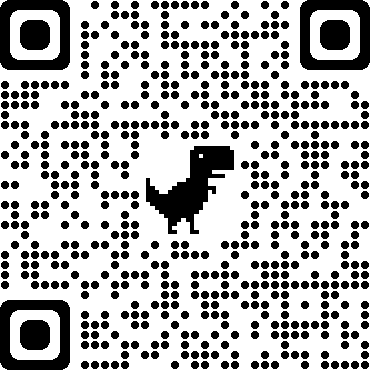

# vue-slim-popup

English | [简体中文](./README.zh-CN.md)

## ✨ Feature
* Solve the mobile terminal scroll penetration
* Stability: Experienced various large-scale event page verification

## 🌰 Example



[Demo](https://komomoo.github.io/vue-slim-popup/demo/dist/)

[Demo Source Code](https://github.com/komomoo/vue-slim-popup/blob/master/demo/App.vue)

## 🚀 QuickStart

1.  Install

```bash
yarn add vue-slim-popup # OR npm i -S vue-slim-popup
```

2.  Import

```js
// *.vue
import SlimPopup from 'vue-slim-popup'
export default {
  /* ... */
  components: {
    SlimPopup,
  },
  /* ... */
}
```

3.  Usage. Please refer to the [Demo Source Code](https://github.com/komomoo/vue-slim-popup/blob/master/demo/App.vue)
```html
  <SlimPopup :show.sync="show">
    <!-- this is a slot, here you can place any element -->
  </SlimPopup>
```

## 🔌 API

### Props

| Name | Description | Type | Default |
| --- | --- | --- | --- |
| show | .sync | Boolean | false |
| hideOnMaskClick | click on the mask to hide the popup | Boolean | false |
| forceRenderOnShow | force render in the popup show | Boolean | false |
| maskTransition | mask transition | String | slim-fade |
| popupTransition | popup transition. Optional: 'slim-scale-center', 'slim-zoom-center', 'slim-slide-top', 'slim-slide-bottom', 'slim-slide-left', 'slim-slide-right'. If it is empty, select the default animation according to popupPosition | String | null |
| maskClass | mask class | Array<String> | null |
| popupClass | popup class | Array<String> | null |
| maskStyle | mask style | Object | null |
| popupStyle | popup style | Object | null |
| popupPosition | popup position. Optional: 'center', 'top', 'bottom', 'left', 'right' | String | center |
| preventMaskTouchmove | prevent touchmove event in the mask | Boolean | true |
| preventPopupTouchmove | prevent touchmove event in the popup(it will cause the popup area to unable to scroll) | Boolean | true |
| preventBodyScroll | prevent body scroll, indirect blocking the effect of scrolling through(popup area can to sroll). Enable this option and disable preventPopupTouchmove, you can scroll the popup area while blocking the effect of scrolling through | Boolean | false |

### Events
| Name | Description | Parameters |
|---|---|---|
| maskClick | mask area clicked | undefined |
| popupClick | popup area self clicked | undefined |

---

😉😘 If it is helpful to you，please encourage me with a <b>⭐️<a href="#">Star</a></b> ~

## [Changelog](./CHANGELOG.md)

## License

[MIT](http://opensource.org/licenses/MIT)

Copyright (c) 2018-present, komo
